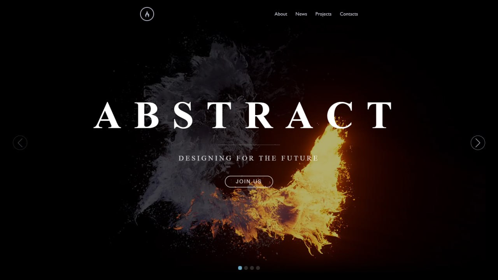

# site-fire-water

This is a visual demo site featuring animation effects and transitions.

**Technologies used:**

- **Swiper.js** — handles the slider logic, including:
    - custom speed and mousewheel navigation
    - pagination and navigation buttons
    - `slideChange` and `transition` events for sync behavior

- **GSAP** — used for syncing video playback with the current slide:
    - on each slide change, `gsap.to()` animates the `video.currentTime`
    - smooth easing for video scrubbing (`Power2.easeOut`)
    - also handles visual class toggling (`.change`) during transitions

- **SCSS** — for organized styling with nesting and variables

Inspired by a concept seen on YouTube.

**Live demo:** [See it in action](https://ysanew.github.io/site-fire-water/)